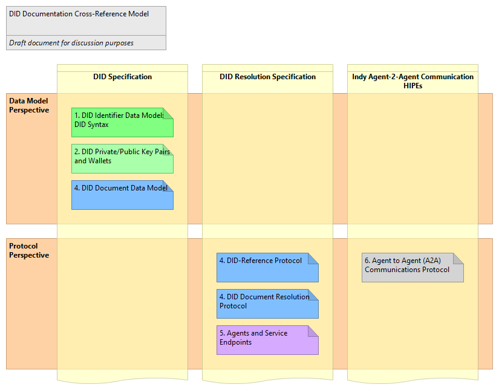
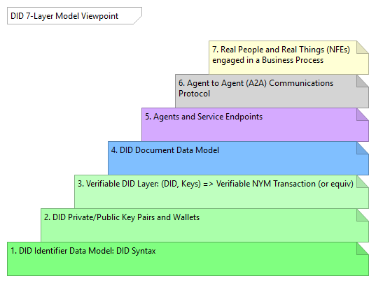

# indy-arm - Hyperledger Indy/Sovrin/DID Comprehensive Architecture Reference Model (INDY ARM)
_Draft document for discussion purposes_

- Michael Herman (Toronto/Calgary/Seattle)
- Hyperonomy Business Blockchain Project / Parallelspace Corporation
- January 2019

Update cycle: As required – sometimes several times in a single day.

## Overview

The purpose of the  Hyperledger Indy/Sovrin/DID Comprehensive Architecture Architecture Reference Model (INDY ARM) is to provide a complete, reliable, precise, visual reference for the concepts presented in the draft Decentralized Identifiers (DIDs) specification (link).

The primary audience for this article are: software people (software architects and developers), enterprise architects, and anyone new to the Hyperledger Indy project or the field of self-sovereign identity (SSI) looking to find a fast on-ramp.

## Goals

The goals of the INDY ARM are:

- Create a complete, reliable, precise, visual model depicting Decentralized Identifiers (DIDs), DID Entities, DID Documents, and the companion Hyperledger Indy ecosystem of software projects, software components, and data elements.
- Enable software people to become more knowledge about and productive with the Hyperledger Indy software platform (and Sovrin governance framework) as quickly and as easily as possible.
- Provide a common language of discourse for describing the current state architecture as well as potential future state architectures for the Indy ecosystem and community (with particular focus emphasis on the needs and requirements of software people).

## Principles

The guiding principles for the INDY ARM are:

- Provide reliable documentation: timely, accurate, visual, and complete
- Save as much of a software person’s time as possible
- Leverage open source modeling specifications and tools like ArchiMate and Archi, respectively
- Leverage enterprise architecture concepts to explain Decentralized Identifiers and Entities in a way doesn’t detract from the adoption of the INDY ARM

## Drivers

The drivers for the INDY ARM are:

- The initial driver for the INDY ARM is the create a reference model to help correct a series of issues found in the draft DID specification and documented in the project’s GitHub issues list (Fall 2018).

NOTE: Some of the elements depicted in the INDY ARM have been influenced by the Verified Credentials project – particularly, the business roles and processes in the Business Layer (1), the Local Ledger State (17) in the Technology Layer – Data Model (15), and the Credential Registry Agent Node (39) in the Technology Layer (30).

## Companion Articles

- [What is a DID?](https://hyperonomy.com/2019/01/24/what-is-a-did/)
- [INDY ARM In Practice: End-to-end Path from id (DID) to a Real-Life Something](https://hyperonomy.com/2019/01/04/the-path-from-a-id-did-to-a-real-life-something/)
- [Vision: Trusted Digital Web](https://hyperonomy.com/2018/12/31/the-trusted-digital-web/)

## Tooling

- [ArchiMate Modeling Specification: The Open Group ArchiMate 3.0 Specification](http://pubs.opengroup.org/architecture/archimate3-doc/)
- [Archi Modeling Tool: Archi, the open source ArchiMate modeling platform](https://www.archimatetool.com/)

## INDY ARM

### Recent Feedback and Changes

1. Ledger Agent Node changed to Ledger Node (@danielhardman)
2. Ledger Nodes: A2A Protocol corrected to Ledger-to-Ledger Protocol (@danielhardman)
3. Relationships added to depict A2A Protocol messaging between Edge Agents and Cloud Agents (@danielhardman)
4. (“Identity” Layer) appended to Business Layer – Architecture (@mwherman2000)
5. (“Edge” Layer) appended to Application Layer – Architecture (@mwherman2000)
6. (“Cloud” and “Ledger” Layers) appended to Technology Layer – Architecture (@mwherman)
7. Owner changed to Controller in (P2) (per CCG discussion Jan. 15 2019)
8. Principle P7 added. See #4.
9. Non-Fungible Entities added to Principles. (P8) and (P9) added. (P1) updated.
10. Element (3) is now shown as copies of the same (3a) and (3b).
11. “inanimate thing” changed to Non-Fungible Entity (10).
12. Principle P4 reworded. DID Entity (14) redefined.
13. Indy Ledger Local Node State changed to Indy Ledger Local Node State (Replica) (36) and (38).
14. Indy Ledger (Journal) changed to Indy Ledger Local State (17).
15. Indy Transactions changed to Indy Transactions (Journal) (17).
16. Removed DID Resolver Full Node (@peacemaker).
17. Four perspectives added to the both of the ARM.
18. Indy Ledger Local Node State (Replica) was changed to Local Ledger State (Replica).
19. Partitioned the DID Data Model (old 12) perspective into DID Document Data Model (44) and DID Data Model (new 12) perspectives.
20. Added elements (44) to (50) to support change 19.
21. Renamed "Service" elements to "Service Endpoint" where appropriate (51) through (56)
22. Numbered Service Endpoint elements (51) through (56)
23. Adjusted position of the some of the numbers

### Architecture Perspectives

Horizontally, the INDY ARM is partitioned into 4 perspectives:

- Projects and Distributions (A)
- Ecosystem Architecture (B)
- DID Data Model (C)
- DID Document Data Model (D)
- [Verified Credentials (VC) Data Model] (Future)
- Principles (E)

### Architecture Domains

Vertically, the INDY ARM is divided into 3 architecture domains that span the 4 perspectives:

- Business Layer (1) and (8)
- Applications Layer (23), (44), and (12)
- Technology Layer (30), (49), and (15)

## INDY ARM Viewpoints

The main or primary view is the All-in viewpoint. In addition, based on the needs of various discussion forums (e.g. did-spec, did-resoltuon, Hyperledger Indy Rocketchat channels, etc.), a number of additional "alternative" or focused viewpoints have been created.

1. [All-in Viewpoint](./README.md#1-all-in-viewpoint) (first time readers should focus here)
2. [DID Data Model and DID Document Data Model Viewpoint](./README.md#2-did-data-model-and-did-document-data-model-viewpoint)
3. [DID Resolution Viewpoint](./README.md#3-did-resolution-viewpoint)
4. [Agent and Wallet Viewpiont](./README.md#4-agent-and-wallet-viewpoint)
5. [DID Entity Viewpoint](./README.md#5-did-entity-viewpoint)
6. [DID Subjects Viewpoint](./README.md#6-did-subjects-viewpoint)

### 1. All-in Viewpoint

The INDY ARM is illustrated in the following “All-in” viewpoint. The INDY ARM is an actual queryable model – it is not a drawing (e.g. a Visio or PowerPoint diagram).

The Narration section that follows the graphic includes a description of each of the numbered bullets.

Click on the graphic to enlarge it in a separate browser tab. Suggestion: Drag the new browser tab onto a second monitor if you have one.

Figure 1. Hyperledger Indy/Sovrin/DID Comprehensive Architecture Reference Model (INDY ARM): All-in Viewpoint

#### Narration

1. **Business Layer (“Edge” Layer) of the INDY ARM.** “The Business Layer depicts business services offered to customers, which are realized in the organization by business processes performed by business actors.” [ARCHIMATE]
    - The following Actor Roles are depicted in this version of the ARM: Issuer, Holder (x 2), Inspector, and Verifier. These roles are not formally defined in the draft DID specification; for the time being, they have been borrowed from the documentation related to the Verified Credentials project.
2. An Issuer issues a self-sovereign identity (SSI) for a Something; e.g. a Birth Certificate or a Purchase Order (3). In this example, the SSI is for a Thing (10); in particular, a completed and approved Purchase Order (3) (or Birth Certificate). The Purchase Order is issued to a Holder. Both the Issuer and the Holder work for a fictitious company called Acme Corporation.
3. SSI for a Something (e.g. Birth Certificate, Purchase Order) issued by the Issuer @ Acme (2).
4. The Holder @ Acme accepts the SSI for the Thing (a Purchase Order) from the Issuer (2). In turn, the Holder @ Acme presents the SSI for the Purchase Order to a Holder at Baker Limited. The Holder @ Baker receives the SSI for the Purchase Order from the Holder @ Acme (4).
5. An Inspector @ Baker may request that the Holder @ Baker present the SSI for the Purchase Order to him/her/it. The Inspector @ Baker receives the SSI from the Holder @ Baker.
6. The Inspector @ Baker (or any Holder) can ask for the SSI for the Purchase Order to be verified by a Verifier.
7. There is a set of Business Services (e.g, Issue, Store, Request, Verify, Register, etc.) that support the above processes. These Business Services are supported by services exposed by the Applications Architecture Layer (23).
8. **Business Layer – DID Data Model** captures the key business-level model elements such as Actor (9), Things (10), and (Business) Processes (37).
9. An Actor is “a business entity that is capable of performing behavior.” [ARCHIMATE]
    - Examples of Actors include Persons, Organizations, and Software Agents.
    - An Actor can have a Controller (P7). A Controller of an Actor is an Actor (P7).
10. A Thing is Non-Fungible Entity (NFE) (P9).
    - Examples of Things include Pets (with embedded ID chips), Cars, Houses, Business Documents, Products, Assemblies, and Parts.
    - The software component of a Software Agent is a Thing. If you’re talking about Software Agent as a business entity capable of performing behavior, then the Software Agent, in this context, is an Actor.
    - A slice of a particular kind of Toast is not a Thing because it is fungible (P8) and (P9). A slice of Toast can be a Thing in the future when each slice of bread has its own bar code or serial number. A photo of a slice of Toast is a Thing because it is non-fungible (most photographs are non-fungible; hence, are Things).
    - A living cell (skin cell, blood cell, etc.) is not considered to be an Actor (or a Thing). It is not a business entity nor a Non-Fungible Entity (P9) (within a single body of DNA) ..at least, not for the foreseeable future.
    - A Thing has a Controller (P2). A Controller of a Thing is an Actor (P2).
11. (Business) Processes. Actors (Persons, Organizations, and Software Agents) participate in Processes. A Process acts on/accesses Things (e.g. a Pet (with an embedded ID chip), Car, House, Business Document, Product, Assembly, Part) to perform work.
12. **Application Layer – DID Document Data Model** captures the key application-level model elements related to DID Documents such as id (DID) (13) and DID Entity (14).
13. id (DID) exists as an attribute of a DID Entity (14) (and by implication, as an attribute of DID Document (16), the JSON-LD serialization of the corresponding DID Entity (14)).
    - The id (DID) attribute is given the nickname “DID” (aka Decentralized Identifier) for convenience; but more importantly, to clarify what a DID specifically refers to (as well as to clarify what the term DID specifically does not refer to). “DID” should only be used to refer to the id (DID) attribute of a DID Entity (or DID Document).
    - id (DID) are used to index, find, and retrieve DID Documents from the Technology Layer (30).
14. A DID Entity is a data structure comprised of a collection of key-value pairs with keys such as: id (DID), service (endpoints), authentication, publicKey, @context, etc. (P4)
    - DID Entities have a set of attributes that includes the following:
    - id (DID)
    - service (endpoints)
    - authentication
    - publicKey
    - @context
    - etc.
15. **Technology Layer – DID Document Data Model** captures the key technology-level model elements such as a DID Document (16).
16. A DID Document is a JSON-LD serialization of a DID Entity (14).
    - A DID Document has a set of attributes that includes the following:
    - id (DID) (13)
    - service (endpoints)
    - authentication
    - publicKey
    - @context
    - etc.
    - The id (DID) attribute (13) is the unique identifier or key for the DID Document.
    - The id (DID) attribute is given the nickname “DID” (aka Decentralized Identifier) for convenience; but more importantly, to clarify what a DID specifically refers to (as well as to clarify what the term DID specifically does not refer to). “DID” should only be used to refer to the id (DID) attribute of a DID Entity (14) (or DID Document).
    - id (DID) are used to index, find, and retrieve DID Documents from the Technology Layer (30). id (DID) exists as an attribute of a DID Entity (14) (and by implication, as an attribute of DID Document, the JSON-LD serialization of the corresponding DID Entity).
17. When DID Documents (16), in turn, are serialized to the Local Ledger State (36) and (38) by the Indy Ledger Nodes (35) and (37), they are stored as a series of Indy Ledger Transactions. Edge Agents and Cloud Agents call an Indy Ledger Node to persist a DID Document to the Indy Ledger. DID Documents, specifically, are written to the Indy Ledger by the Indy Ledger Nodes using:
    - Indy NYM transactions (50), and
    - Indy ATTRIB transactions.
18. **Technology Layer – Projects and Distributions** highlights the Hyperledger (and potentially other) open source projects that design, build, and supply software components to both the Applications and Technology Layers.
19. The Hyperledger Indy-SDK Project distribution includes two key software components used to implement an Indy Wallet (25) and (32):
    - libIndy (lower-level)
    - libVCX (higher-level)
20. The Hyperledger Indy-Agent Project distribution is used to implement the Indy Agent functionality in the:
    - Edge Agent App (24)
    - Edge Agent Web App (28)
    - Edge Agent Lightweight App (29)
    - Cloud Agent Node (31)
    - Ledger Node (35), and
    - Credential Registry Agent Mode (39)
21. The Hyperledger URSA Project distribution is a utility that provides implementations of the cryptographic functionality required across all of the Hyperledger projects.
22. The Hyperledger Indy-Node Project distribution is used to implement the Indy Node functionality in the Ledger Node (35) and (37).
23. **Applications Layer (“Edge” Layer) of the INDY ARM.** “The Application Layer depicts application services that support the business, and the applications that realize them.” [ARCHIMATE]
24. The Edge Agent App 1 is an end-user application for interacting with the self-sovereign identities an Actor owns: personal, organizational, as a Controller of Thing, or as a Guardian of another Actor (9) and (10). This is typically a mobile or a desktop app.
25. The Edge Wallet is a mobile or desktop application component that supports the Edge Agent App’s requirements (24) for managing actual self-sovereign identities it owns.
26. Edge Agent App 2 is an example of another Edge Agent App in the ecosystem. Communication between Edge Agent Apps takes place using the Indy Agent-to-Agent Protocol (A2A Protocol) (27).
27. The Indy Agent-to-Agent Protocol (A2A Protocol) is the protocol used for communication between Edge Agent Apps (24) and (26) and Cloud Agent Nodes (31) and (33).
28. The Edge Agent Web App is an Edge Agent implemented as a server-hosted web application.
29. The Edge Agent Lightweight App (EAPA) is a mobile or desktop application that doesn’t use a local Edge Wallet. Instead, the EAPA relies on the services of a Cloud Agent (31) and Cloud Wallet (32).
30. **Technology Layer (“Cloud” Layer) of the INDY ARM.** “The Technology Layer depicts technology services such as processing, storage, and communication services needed to run the applications, and the computer and communication hardware and system software that realize those services.” [ARCHIMATE]
31. The Could Agent App 1 is a cloud or server-based application for interacting with the self-sovereign identities an Actor owns: personal, organizational, as a Controller of Thing, or as a Guardian of another Actor (9) and (10). The Cloud Agent App is an alternative to using an Edge Agent App (24) and Edge Agent Wallet (25).
32. The Cloud Wallet is a cloud or server-based technology component that supports the Cloud Agent App’s requirements (31) for managing actual self-sovereign identities it owns.
33. Cloud Agent App 2 is an example of another Cloud Agent App in the ecosystem. Communication between Cloud Agent Apps takes place using the Indy Agent-to-Agent Protocol (A2A Protocol) (34).
34. The Indy Agent-to-Agent Protocol (A2A Protocol) is the protocol used for communication between Edge Agent Apps (24) and (26) and Cloud Agent Nodes (31) and (33).
35. Ledge Agent Nodes support the requirements of Edge Agent (24) and Cloud Agent (31) applications for persisting, managing, and interacting with DID Documents (16) persisted to the Indy Ledger (36) and (17).
36. Local Ledger State (Replica) is the distributed ledger technology that supports the persistence, management of DID Documents (16) persisted to the ledger as Indy NYM and ATTRIB transactions (17).
37. Ledge Agent Node 2 is an example of another Ledge Agent Node in the ecosystem. Communication between Ledge Agent Nodes takes place using the Indy Ledger-to-Ledger Protocol (38).
38. Local Ledger State (Replica) is the distributed ledger technology that supports the persistence, management of DID Documents (16) persisted to the ledger as Indy NYM and ATTRIB transactions (17).
39. The Indy Ledger-to-Ledger Protocol is the protocol used for communication between Ledger Nodes (35) and (37).
40. Credential Registry Agent Node is a repository for persisting, managing, and interacting with Verified Credentials. It’s implementation is based on technologies similar to those used to implement Cloud Edge Agents.
41. DID Resolver Lightweight Node is a component that is used by Edge Agent (24) and Cloud Agent (31) applications to resolve a id (DID) (13) into a specific DID Document (16) (assuming the DID Document has been persisted to the Indy Ledger (36) and (17)). The DID Resolver Lightweight Node relies on a Ledger Node (35) and (37) to gain access to the Indy Transactions (17) on the Indy Ledger (36). The DID Document is returned as an attribute of a DID Resolver Response (43) a the DID Resolver Node.
42. The DID Resolver Response is returned by the DID Resolver Lightweight Node (40) in response to a request to resolve a particular id (DID). The DID Resolver Response contains a didDocument attribute that, in turn, contains the corresponding DID Document (16) (assuming the DID Document exists on the Indy Ledger (36), (42) and (17)).
43. The DIF Universal-Resolver Project distribution is used to implement the DID Resolver Lightweight Node (41) functionality.
44. **Application Layer – DID Data Model** captures the key application-level model elements related to DIDs such as SEND_NYM Message (45).
45. A SEND_NYM message is used to create a Verifiable DID on the Ledger (17)
46. The identifier attribute in the SEND_NYM message is associated (assigned the value) of the DID of the steward/trustee.
47. The dest subattribute in the SEND_NYM message is associated (assigned the value) of the DID of the subject.
48. The verkey subattribute in the SEND_NYM message is associated (assigned the value) of the verkey of the subject.
49. **Technology Layer – DID Document Data Model** captures the key technology-level model elements such as the DID Ledger State (17) and Indy NYM Transaction (50).
50. Indy NYM Transaction
51. Indy Agent Service Endpoint (Cloud Agent 1)
52. Indy Agent Service Endpoint (Cloud Agent 2)
53. Indy Ledger Node Service Endpoint (Ledger Node 1)
54. Indy Ledger Node Service Endpoint (Ledger Node 2)
55. Indy Credential Registry Service Endpoint
56. DID Resolver Service Endpoint

### 2. DID Data Model and DID Document Data Model Viewpoint

*Draft document for discussion purposes*

The DID Data Model and DID Document Data Model viewpoint is an example of alternative viewpoint that illustrates how _cookie cutter_ subviews of the All-in viewpoint can be created from the same underlying INDY ARM moodel.

Figure 2. DID Data Model and DID Document Data Model Viewpoint

#### Nararation

See the cooresponding numbered elements in the [Narration](https://github.com/mwherman2000/indy-arm/blob/master/README.md#narration) section for the All-in viewpoint.

### 3. DID Resolution Viewpoint

*Draft document for discussion purposes*

The DID Resolution viewpoint is an example of yet another alternative viewpoint that illustrates how _cookie cutter_ subviews of the All-in viewpoint can be created from the same underlying INDY ARM model.

NOTE: Also refer to the discussion in [Appendix E - DID Resolution: Path from a DID to a Real-life Something](https://github.com/mwherman2000/indy-arm/blob/master/README.md#appendix-e---did-resolution-path-from-a-did-to-a-real-life-something).

Figure 3a. DID Resolution Viewpoint

TODO

*Draft document for discussion purposes*

TODO

Figure 3b. DID Resolver Architecture

#### Narration

See the cooresponding numbered elements in the [Narration](https://github.com/mwherman2000/indy-arm/blob/master/README.md#narration) section for the All-in viewpoint.

### 4. Agent and Wallet Viewpoint

*Draft document for discussion purposes*

The Agent and Wallet viewpoint is an example of an alternative (focused) viewpoint that depicts the architectural elements that comprise an Indy Agent and an Indy Wallet.

Figure 4. Agent and Wallet Viewpoint

#### Narration

See the cooresponding numbered elements in the [Narration](https://github.com/mwherman2000/indy-arm/blob/master/README.md#narration) section for the All-in viewpoint.

### 5. DID Entity Viewpoint

*Draft document for discussion purposes*

The DID Entity vuewpoint is an example of an alternative (focused) viewpoint that depicts the architectural elements that rrealize a DID Entity (DID SUbject).

Figure 5. DID Entity (DID Subject) Viewpoint

### 6. DID Subjects Viewpoint

*Draft document for discussion purposes*

The DID Subjects viewpoint is an example of an alternative (focused) viewpoint that depicts the architectural elements that rrealize a DID Entity (DID SUbject).

Figure 6. DID Subjects Viewpoint

#### Narration

See the cooresponding numbered elements in the [Narration](https://github.com/mwherman2000/indy-arm/blob/master/README.md#narration) section for the All-in viewpoint.

## Appendix A - DID 6-Layer Model

TODO

### Steps, Documentation, and Precidents Viewpoint

*Draft document for discussion purposes*

Figure A.1. DID 6-Layer Model: Steps, Documentation, and Precidents Viewpoint

#### Narration

TODO

### Documentation Cross-reference Viewpoint

*Draft document for discussion purposes*

Figure A.2. DID 6-Layer Model: Documentation Cross-reference Viewpoint

#### Narration

TODO

## Appendix B - Indy Agent Architecture Reference Model (INDY-AGENT-ARM)

To understand the INDY-AGENT-ARM more fully, read the [INDY HIPE](https://github.com/hyperledger/indy-hipe/pulls) entitled [0002: Agents](https://github.com/hyperledger/indy-hipe/blob/31df09b3949021d790ebc364d7da1b9347821d87/text/0002-agents/README.md) written by Daniel Hardman.

### Location and Capabilities Viewpoint

Figure B.1. Indy Agent Architecture Reference Model (INDY-AGENT-ARM)

#### Narration

To understand the INDY-AGENT-ARM more fully, read the [INDY HIPE](https://github.com/hyperledger/indy-hipe/pulls) entitled [0002: Agents](https://github.com/hyperledger/indy-hipe/blob/31df09b3949021d790ebc364d7da1b9347821d87/text/0002-agents/README.md) written by Daniel Hardman.

## Appendix C - Internet Naming Continuum

TODO

*Draft document for discussion purposes*

Figure C.1. Internet Naming Continuum

#### Narration

TODO

## Appendix D - DID 7-Layer Model

TODO

*Draft document for discussion purposes*

Figure D.1. DID 7-Layer Model

#### Narration

TODO

## Appendix E - DID Resolution: Path from a DID to a Real-life Something

*Draft document for discussion purposes*

### Companion Articles
- [What is a DID?](https://hyperonomy.com/2019/01/24/what-is-a-did/)
- [INDY-ARM - DID Resolution Viewpoint](./README.md#3-did-resolution-viewpoint)

### Path from a DID to a Real-life Something Viewpoint

The following graphic illustrates the path (flow) of a client app trying to: 
a) communicate/interact with, and/or 
b) access the metadata about a real-life something by using a Decentralized Identifier (id (DID)).

That is, in (almost) 10 steps or less, how to you get from an id (DID) attribute on the left to a Real-Life Something on the right?

2019-01-08 NOTE: The ultimate goal is to synthesize a simple(r) data model – not a more complex one. However, the interim analysis phase (tearing things apart) is expectedly going to result in a data model that is visually more complex. From this analysis model, we can hopefully synthesize a data model that is simple(r).

NOTE: Click on the graphic to enlarge it.

Figure E.1. DID Resolution: Path from a DID to a Real-life Something

#### Narration

0. A DID Document contains an id (DID) attribute which is the unique identifier or key for a DID Document.
    - A Real-Life Something can be associated with more than one DID Document (and by implication, more than one id (DID)).
    - A DID Document (and its id (DID)) can only refer to one Real-Life Something.
1.	Client App (or Service) is interested in either:
    - Communicating or interacting with a Real-Life Something.
    - Gaining knowledge about a Real-Life Something. (Let’s refer this knowledge as Metadata about the Real-Life Something.)
    - NOTE: A Real-Life Something can be either a Real-Life Actor or a Real-Life Thing.
2.	Client App calls DID Resolver to retrieve the DID Document that corresponds to a particular id (DID).
3.	DID Resolver uses the id (DID) as a key (unique identifier) to retrieve the corresponding DID Document from a DID Document Repository (14).
4.	DID Resolver, in turn, returns the DID Document to the Client App.
5.	The DID Document contains a service (endpoint) attribute that points to the Software Service Endpoint for the entity where:
    - Client App can communicate or interact with a particular Virtual (Real-Life) Something (primary use case).
    - Client App can retrieve additional information about a particular Real-Life Something (aka Metadata about the Virtual (Real-Life) Something) (secondary use case and, potentially, a sub-case of the primary use case).
6.	Client App calls Software Service Endpoint to either: a) communicate/interact with, or (b) retrieve metadata about a Virtual (Real-Life) Something.
7.	[Primary Use Case] Software Service Endpoint enables Client App to communicate or interact with a particular Virtual (Real-Life) Something.
8.	Virtual Actor is a Virtual (Real-Life) Something that is associated with a Real-Life Actor (9).
9.	Real-Life Actor is a Real-Life Something that is associated with a Virtual (Real-Life) Actor (8).
10.	Virtual Thing is a Virtual (Real-Life) Something that is associated with a Real-Life Thing (11). A Virtual Thing has an Owner. The Owner of a Virtual Thing is a Virtual Actor.
11.	Real-Life Thing is a Real-Life Something that is associated with a Virtual (Real-Life) Thing (10). A Real-Life Thing has an Owner. The Owner of a Real-Life Thing is a Real-Life Actor.
12.	[Secondary Use Case] Client App retrieves Metadata Document about Virtual (Real-Life) Something from the Metadata Document Repository (15) by calling Software Service Endpoint. As in the primary use case, the Virtual (Real-Life) Something can be a Virtual Actor or a Virtual Thing.
13.	Software Service Endpoint returns the Metadata Document for the particular Virtual (Real-Life) Something to the Client App; that is, the knowledge about the Virtual (Real-Life) Something that the Client App was originally interested in Step 1.
14.	DID Document Repository is a repository of DID Documents indexed by each document’s id (DID).
15.	Metadata Document Repository is a repository of Metadata Documents.

#### Additional Notes

1. An Actor is simply defined as being different from a Thing because an Actor is “a business entity that is capable of performing behavior” [ARCHIMATE].
2. A Thing has an Owner.
3. The Owner of a Thing is an Actor.

### Questions

1. Can the data from the Metadata Document (6) be merged into/placed inside the DID Document (0)?  If so how?
   - Daniel Hardman (2019-01-07): A DID Document can contain additional sections besides those required by the spec – but I am not aware of a way to describe those sections in an interoperable way. So adding extra metadata to the DID Document would require a new convention or standard to be described.
2. Related but separate from the first question, where does the Indy Schema effort/project artifacts (e.g. Schema Documents) fit into the above graphic?
   - Daniel Hardman (2019-01-07): “Schema” is currently used mostly to describe credentials. We could apply the concern more broadly (e.g., to A2A messages), but there is not a common understanding of anything broader.
3. Is there a third repository (Schema Document Repository) that needs to be added to the graphic? …or is schema stored as “just another” DID Document in the DID Document Repository?  If so, in the most likely scenario, is there a separate DID Document Repository that acts as a global Schema Document Repository. Are Schema Documents resolved through the same DID Resolver (2)?
   - Daniel Hardman (2019-01-07): Schemas for credentials are stored on the ledger – not in DID Documents, but in separate SCHEMA transactions. A schema lookup is a ledger lookup, but not a DID Document lookup. Schemas are not indexed by DID, since they do not require an endpoint or key rotation construct–but rather by an identifier that helps the ledger walk its own state trie with maximum efficiency
4. Is the extended data for an entity stored in the original DID Document (0) (based on the Extensibility feature of a DID Document) and can/does this feature explicitly rely on Schema?
    - TODO

